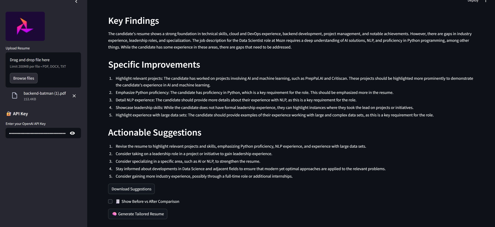

# 🚀 Smart Resume Optimizer (with LLM + PDF/DOCX Export)

This is a smart AI-powered resume optimization tool built using **Streamlit**, **LlamaIndex**, and **OpenAI/Anthropic models**. It helps job seekers fine-tune their resumes for any job description—ATS-ready, recruiter-friendly, and personalized.

### ✨ Features

-  **AI Resume Analyzer**  
  Get key findings, improvement points, and actionable suggestions based on your resume and job description.

-  **Before vs After Comparison**  
  See what’s changed—line-by-line comparison between original and optimized versions.

-  **ATS Score Tracker**  
  See how closely your resume aligns with a job description based on keyword matching.

-  **Tailored Resume Generator**  
  Generate an entirely rewritten resume tailored for a specific role—instantly downloadable.

-  **Export Formats**  
  Export your results in **TXT**, **PDF**, or **Word (DOCX)** formats.

-  **Dark Mode UI**  
  Sleek, modern interface with dark mode for a polished visual experience.

---

##  Preview

###  Resume Preview & Upload  


###  AI Suggestions  


###  Tailored Resume Generator  


---

##  How to Run

```bash
git clone https://github.com/notrohit123/resume_optimizer_llamaindex.git
cd resume_optimizer_llamaindex
python -m venv venv
source venv/bin/activate  # or venv\Scripts\activate on Windows
pip install -r requirements.txt
streamlit run app/main.py
